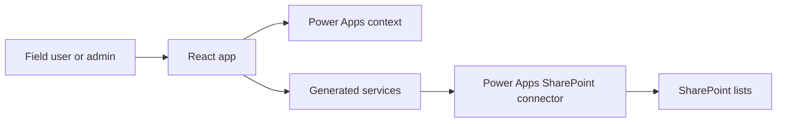

# Architecture

This application is a single-page React app hosted as a Power Apps Code App. It uses Vite for local development and bundling, then relies on generated Power Apps connector services for SharePoint data access.

## Runtime overview

The browser app owns all UI state. Data persistence goes through generated service classes such as `ServiceOrdersService`, `Drivers1Service`, and `ServiceOrderProofQueueService`.

## Main application file

Most of the app currently lives in `src/App.tsx`. The file contains:

- Inline SVG icon definitions.
- Shared form and response types.
- Customer hierarchy helpers.
- Proof image compression helpers.
- Scale-photo OCR state and crop orchestration.
- Reusable form controls.
- Sidebar, order table, admin page, wizard steps, signature pad, and photo upload components.
- Top-level app state, data loading, admin routing, and submit orchestration.

This is workable for the current app size, but new feature work should prefer extracting stable pieces into focused files:

- `components/` for reusable UI such as select, date picker, modals, signature pad, and photo upload.
- `features/service-orders/` for wizard steps and submit logic.
- `features/admin/` for admin reference-data pages.
- `lib/customerHierarchy.ts` for customer option derivation.
- `lib/proofMedia.ts` for photo compression and proof queue payload creation.
- `lib/weightOcr.ts` for OCR preprocessing and weight parsing if the current helper grows beyond scale-photo concerns.

## Startup flow

1. `src/main.tsx` renders `App` inside React `StrictMode`.
2. `App` initializes UI, form, proof, admin, and reference-data state.
3. `loadReferenceData()` fetches customer rows, drivers, vehicles, waste categories, and service orders.
4. A separate effect calls `getContext()` from `@microsoft/power-apps/app` to read the current user's principal name.
5. Admin navigation is enabled when the current email is in `ADMIN_EMAILS` and the session is unlocked with the passcode.

Reference-data loading has a 10-second timeout and requires at least one row from `customer-area-data-clean-final`.

## User flows

### Service order creation

The wizard has five steps:

1. Basic Info
2. Customer
3. Assignment
4. Proof
5. Review

Step validation prevents users from advancing when required data is missing. On the assignment step, users can attach a scale photo for each waste line, adjust the crop around the scale display, run OCR, and choose whether to apply the detected value to the tonnage field.

The final submit flow:

1. Validates the title, customer proof signature, and waste lines.
2. Builds a base `service orders` payload.
3. Creates one service-order row for each completed waste line, or one order row when no waste line is complete.
4. Creates mirrored rows in `service order waste items` for completed waste lines.
5. Compresses proof photos to JPEG base64.
6. Creates a `service order proof queue` row with signature and photo payloads.
7. Optionally updates created service orders with proof URLs when returned by the proof upload response.
8. Rolls back created proof queue, waste item, and service order records if the submit flow fails before completion.

### Scale-photo OCR

Scale OCR lives in `src/weightOcr.ts` and is called from the waste-line UI in `src/App.tsx`. The flow is deliberately confirm-before-write:

1. The user chooses an image file for a waste line.
2. The app creates a local preview and preprocesses the image in the browser.
3. The preprocessing step auto-crops likely display regions, creates OCR image variants, and extracts a seven-segment candidate when possible.
4. `runWeightOcr()` queues OCR work so only one recognition pass runs at a time against the shared Tesseract worker.
5. The parser accepts plausible display values greater than 0 and up to 100000, then marks a suggestion reliable only when confidence, plausibility, unit evidence, or cross-pass agreement is strong enough.
6. The UI displays the suggestion, confidence, reasoning, and raw OCR text. Tonnage changes only when the user clicks `Use detected value`.

If `VITE_WEIGHT_OCR_ENDPOINT` is set, the app posts the selected crop image to that endpoint and merges returned text with local OCR candidates. The endpoint is optional; local Tesseract and seven-segment parsing still run without it.

### Admin reference data

Admin users can add, edit, and delete:

- Drivers in `drivers1`
- Vehicles in `vehicles`
- Waste categories in `waste_categories`

The admin pages update local React state after successful connector writes so the UI reflects changes immediately.

## Data access boundary

Generated services in `src/generated/services/` are thin wrappers around the Power Apps data client. They expose common CRUD methods:

- `create(record)`
- `update(id, changedFields)`
- `delete(id)`
- `get(id, options)`
- `getAll(options)`

The generated models in `src/generated/models/` describe SharePoint list fields. These files are generated and should not be manually edited.

## Proof media handling

Signature capture uses a canvas and stores a PNG data URL in component state until submit.

Before and after photos are loaded into an image element, resized so the largest side is at most 720 pixels, encoded as JPEG, and retried at progressively lower quality until the base64 string is no more than 60,000 characters. This keeps the queue payload small enough for connector writes.

Proof media is currently queued in SharePoint through `ServiceOrderProofQueueService`. The app does not directly upload files to a document library.

## Security notes

Admin gating is implemented in the client using the Power Apps user principal name, a hard-coded allow-list, a hard-coded passcode, and `sessionStorage`.

Use SharePoint permissions and Power Platform environment controls for real authorization. Client-side checks are easy to inspect and should be treated as user-experience gates only.
