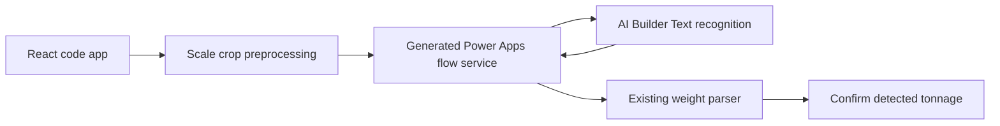

# Power Apps OCR Integration

This app has browser-side OCR code in `src/weightOcr.ts`, but production scale-photo OCR now uses Microsoft AI Builder Text recognition through a Power Automate flow called `RecognizeScaleText`. The flow is called from the code app as a generated Power Apps data source.

## Recommended architecture



Use the Power Platform connector route instead of calling an HTTP trigger URL directly from the browser. HTTP trigger URLs include credentials in the URL, while a generated code-app data source keeps the call under Power Apps connector consent and environment policies.

## Power Platform setup

1. Confirm the environment has AI Builder capacity or trial/paid AI Builder entitlement. Power Apps Premium covers running the code app, but AI Builder consumption is still governed by AI Builder licensing and credits.
2. Create an instant cloud flow named `RecognizeScaleText`.
3. Use the Power Apps trigger, preferably Power Apps (V2).
4. Add one file input named `image`.
5. Add the AI Builder action `Recognize text in an image or a PDF document`.
6. Map the flow file input content to the AI Builder image/document input.
7. Return a compact response to Power Apps with these fields:

```json
{
  "text": "1230 kg",
  "confidence": 0.94,
  "lines": [
    { "text": "1230 kg", "confidence": 0.94 }
  ]
}
```

The app only needs text lines and confidence. Keep bounding boxes out of the first version unless the UI will display Microsoft-detected boxes.

## Add the flow to this code app

After the flow is saved in the same environment as `power.config.json`, add it as a non-tabular data source so the Power Apps CLI generates TypeScript model and service files:

```powershell
pac connection list
pac code add-data-source -a "<flow-or-connector-api-name>" -c "<connection-id>"
```

If your installed Code Apps package exposes the newer npm CLI, use the equivalent `power-apps` command. The important outcome is a generated service under `src/generated/services/`, similar to `UploadServiceOrderProofService`.

Expected generated files will look roughly like:

```text
src/generated/models/RecognizeScaleTextModel.ts
src/generated/services/RecognizeScaleTextService.ts
```

Do not hand-edit generated files. Regenerate them if the flow input or response contract changes.

## Code integration point

Wire the generated service into `src/weightOcr.ts` at `runRemoteWeightOcr()`. That helper sends the selected crop to the generated `RecognizeScaleTextService`, then runs the returned text through the existing weight parser and confidence logic.

The intended change is:

1. Convert the selected crop data URL to file/base64 payload expected by the generated flow model.
2. Call `RecognizeScaleTextService.Run(...)`.
3. Normalize the response with the existing `getRemoteTextItems()` shape.
4. Treat plausible Microsoft OCR numeric output as a user-confirmable suggestion.

Keep the confirm-before-write UX unchanged: AI Builder can suggest a tonnage value, but the app should only write it when the user clicks `Use detected value`.

## Operational notes

- AI Builder Text recognition supports JPG, PNG, BMP, and PDF inputs up to 20 MB. This app sends a cropped image, so payload size should stay well below that limit.
- The current OCR preprocessing creates a tight crop preview. Send that crop to AI Builder, not the original full proof photo.
- Save the returned OCR text in the existing `scaleOcrText` field so users can inspect what the service read.
- Local Tesseract and seven-segment OCR code is intentionally retained but disabled with `ENABLE_LOCAL_OCR = false`.
- Test with clear scale images, glare, partial units, and manual crop adjustment before relying on it in the field.
- If the app is moved to another environment, recreate or reconnect the AI Builder model/flow data source and regenerate the code-app service.
